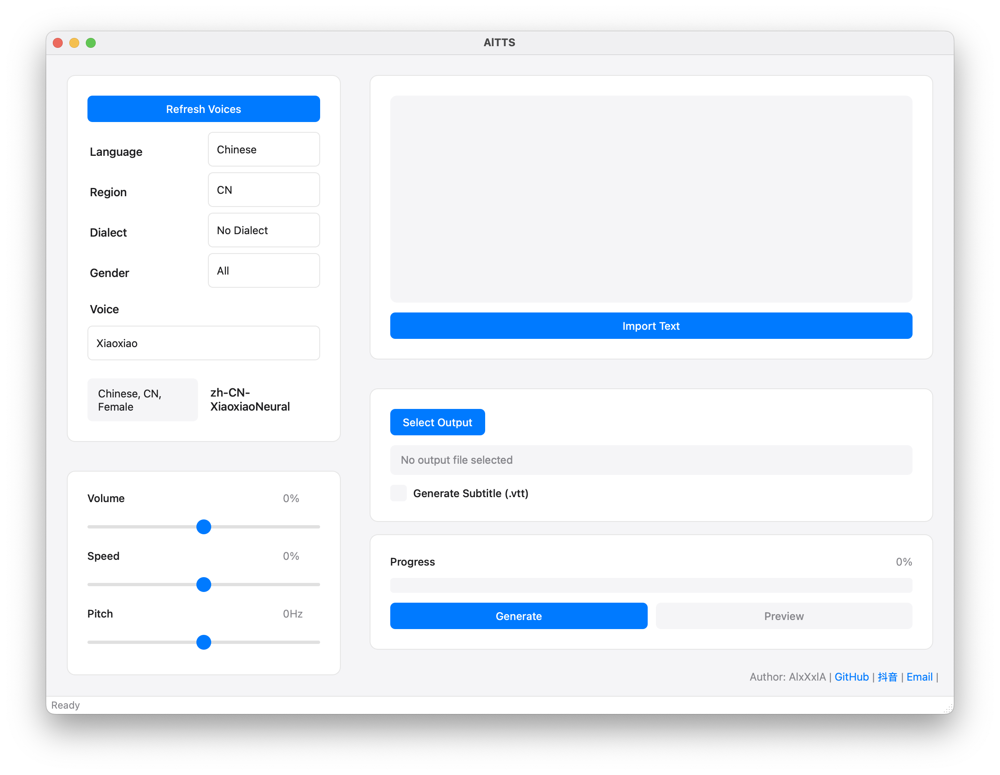
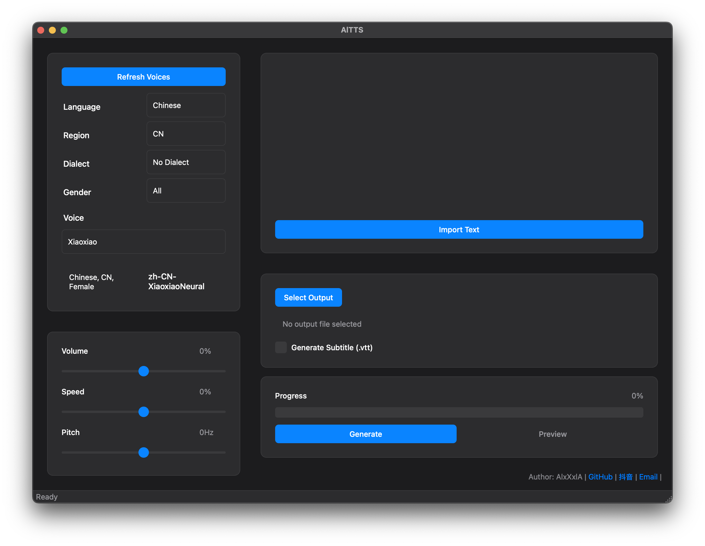

  
  <h1>AlTTS</h1>
  

    <b>基于 Microsoft Edge TTS 引擎的文字转语音工具</b> 
  

    

    
    
    
    
  

    

    
    
    
  

    <kbd></kbd>
    <kbd></kbd>

## ✨ 特性

<table>
  <tr>
    <td width="50%">
      <h3>🎯 核心功能</h3>
      <ul>
        <li>🌍 支持 70+ 种语言和方言</li>
        <li>🎙️ 提供 400+ 种专业音色</li>
        <li>🎚️ 精确的音频参数调节</li>
        <li>📝 智能字幕文件生成</li>
      </ul>
    </td>
    <td width="50%">
      <h3>🎨 界面特性</h3>
      <ul>
        <li>🖥️ 简洁直观的操作界面</li>
        <li>🌓 支持浅色/深色主题</li>
        <li>🌐 中英文双语界面</li>
        <li>🔄 智能系统主题跟随</li>
      </ul>
    </td>
  </tr>
</table>

## 💻 系统要求

<table>
  <tr>
    <th width="50%">macOS</th>
    <th width="50%">Windows</th>
  </tr>
  <tr>
    <td>
      <ul>
        <li>macOS 10.13 或更高版本</li>
        <li>4GB RAM</li>
        <li>100MB 可用磁盘空间</li>
        <li>稳定的网络连接</li>
        <li>Python 3.10+</li>
      </ul>
    </td>
    <td>
      <ul>
        <li>Windows 10 或更高版本</li>
        <li>4GB RAM</li>
        <li>100MB 可用磁盘空间</li>
        <li>稳定的网络连接</li>
        <li>Python 3.10+</li>
      </ul>
    </td>
  </tr>
</table>

## 📖 使用说明

### 1️⃣ 语音选择

* 从语言列表中选择目标语言
* 选择对应的地区和方言（如有）
* 选择性别（男声/女声）
* 从筛选后的音色列表中选择

### 2️⃣ 参数调整

| 参数 | 调节范围 | 建议范围 | 说明 |
|:---:|:---:|:---:|:---|
| 音量 | -100% ~ +100% | -50% ~ 50% | 调节语音输出的响度 |
| 语速 | -100% ~ +100% | -30% ~ 30% | 调节语音播放的快慢 |
| 音高 | -50Hz ~ +50Hz | -20Hz ~ 20Hz | 调节语音的音调高低 |

### 3️⃣ 文本输入

* ✍️ 支持直接输入文本
* 📄 支持导入 .txt 文件
* 📋 支持复制粘贴操作
* ✂️ 支持文本编辑和选择

### 4️⃣ 输出选项

* 📂 自定义输出文件位置
* 💬 可选生成字幕文件（.vtt 格式）
* 🎧 支持音频预览功能
* 📊 实时显示生成进度

## 🚀 功能规划

<table>
  <tr>
    <td width="50%">
      <h3>✅ 已实现功能</h3>
      <ul>
        <li>基础语音合成功能</li>
        <li>多语言界面支持</li>
        <li>深色模式主题</li>
        <li>字幕文件生成</li>
        <li>预览功能</li>
      </ul>
    </td>
    <td width="50%">
      <h3>⏳ 开发计划</h3>
      <ul>
        <li>批量处理功能</li>
        <li>更多音频格式支持</li>
        <li>高级音频参数设置</li>
      </ul>
    </td>
  </tr>
</table>

## ⚖️ 许可说明

  
本软件为专有软件，受版权法和国际条约保护。

  
未经授权的复制、分发或使用本软件可能导致严重的民事和刑事处罚。

### 使用限制
- ⛔ 禁止对软件进行修改、反编译或反向工程
- ⛔ 禁止未经授权的再分发或转授权
- ✅ 仅限用于授权用途
- ℹ️ 不提供任何形式的保证

> 详细条款请查看 [LICENSE](LICENSE) 文件。

## 📞 联系方式

  <h3>AlxXxlA</h3>
  

    
    
    
  

  

  
Copyright © 2024 AlxXxlA. All rights reserved.

