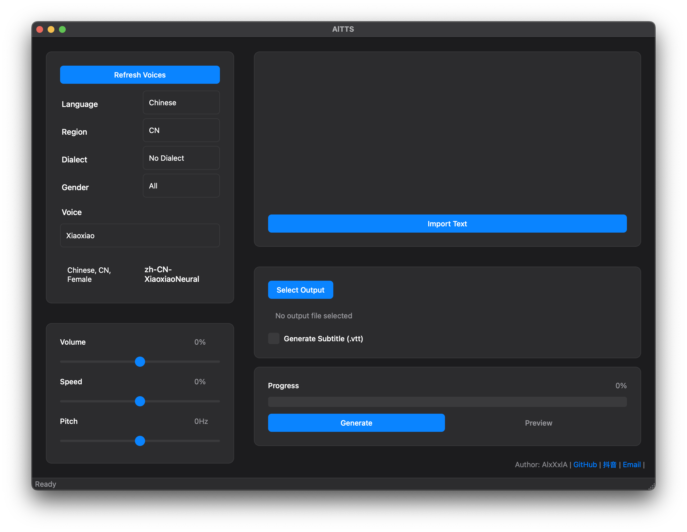

<!DOCTYPE html>
<html lang="zh-CN">
<head>
    <meta charset="UTF-8">
    <meta name="viewport" content="width=device-width, initial-scale=1.0">
    <title>AlTTS - 基于Edge TTS的语音合成工具</title>
    
</head>
<body>
    

        
        <h1>AlTTS</h1>
        
专业的多语言语音合成工具，基于 Microsoft Edge TTS 引擎

        
        

            
            
            
            
        

        

            <a href="https://github.com/alalalex-m/AlTTS/releases" class="button">
                📥 立即下载
            </a>
            <a href="#usage" class="button">
                📖 使用文档
            </a>
            <a href="https://github.com/alalalex-m/AlTTS/issues" class="button">
                🛠报告问题
            </a>
        

    

    

        
        
    

    

        

            <h3>🎯 核心功能</h3>
            <ul>
                <li>支持 70+ 种语言和方言</li>
                <li>提供 400+ 种语音音色</li>
                <li>音频参数调节</li>
                <li>字幕文件自动生成</li>
            </ul>
        

        

            <h3>🎨 界面特性</h3>
            <ul>
                <li>简洁直观的操作界面</li>
                <li>支持浅色/深色主题</li>
                <li>中英文双语界面</li>
                <li>系统主题跟随</li>
            </ul>
        

    

    

        

            <h3>macOS 系统要求</h3>
            <ul>
                <li>macOS 10.13 或更高版本</li>
                <li>4GB RAM</li>
                <li>100MB 可用磁盘空间</li>
                <li>稳定的网络连接</li>
                <li>Python 3.10+</li>
            </ul>
        

        

            <h3>Windows 系统要求</h3>
            <ul>
                <li>Windows 10 或更高版本</li>
                <li>4GB RAM</li>
                <li>100MB 可用磁盘空间</li>
                <li>稳定的网络连接</li>
                <li>Python 3.10+</li>
            </ul>
        

    

    

        <h2>📖 使用说明</h2>
        

            <h3>1️⃣ 语音选择</h3>
            <ul>
                <li>从语言列表中选择目标语言</li>
                <li>选择对应的地区和方言（如果有）</li>
                <li>选择性别（男声/女声）</li>
                <li>从筛选后的音色列表中选择</li>
            </ul>
        

        

            <h3>2️⃣ 参数调整</h3>
            <ul>
                <li>音量调节：-100% 到 +100%（建议范围：-50% 到 50%）</li>
                <li>语速调节：-100% 到 +100%（建议范围：-30% 到 30%）</li>
                <li>音高调节：-50Hz 到 +50Hz（建议范围：-20Hz 到 20Hz）</li>
                <li>实时预览：调整参数后可立即试听效果</li>
            </ul>
        

        

            <h3>3️⃣ 文本输入</h3>
            <ul>
                <li>直接在文本框中输入内容</li>
                <li>支持导入 .txt 文件</li>
                <li>支持复制粘贴操作</li>
                <li>支持文本编辑和选择</li>
            </ul>
        

        

            <h3>4️⃣ 输出选项</h3>
            <ul>
                <li>选择输出文件位置</li>
                <li>可选择是否生成字幕文件（.vtt 格式）</li>
                <li>支持预览功能</li>
                <li>显示生成进度</li>
            </ul>
        

    

    

        <h2>🚀 功能规划</h2>
        

            <h3>当前功能</h3>
            <ul>
                <li>✅ 基础语音合成功能</li>
                <li>✅ 多语言界面支持</li>
                <li>✅ 深色模式主题</li>
                <li>✅ 字幕文件生成</li>
                <li>✅ 预览功能</li>
            </ul>
        

        

            <h3>开发计划</h3>
            <ul>
                <li>⏳ 批量处理功能</li>
                <li>⏳ 更多音频格式支持</li>
                <li>⏳ 高级音频参数设置</li>
            </ul>
        

    

    

        <h2>⚖️ 许可说明</h2>
        

            
本软件为专有软件，受版权法和国际条约保护。未经授权的复制、分发或使用本软件可能导致严重的民事和刑事处罚。

            <h3>使用限制</h3>
            <ul>
                <li>禁止对软件进行修改、反编译或反向工程</li>
                <li>禁止未经授权的再分发或转授权</li>
                <li>仅限用于授权用途</li>
                <li>不提供任何形式的保证</li>
            </ul>
            
详细条款请查看 <a href="LICENSE">LICENSE</a> 文件。

        

    

    

        <h2>📞 联系方式</h2>
        

            <ul>
                <li>作者：AlxXxlA</li>
                <li>GitHub：<a href="https://github.com/alalalex-m">@alalalex-m</a></li>
                <li>抖音：<a href="https://v.douyin.com/iSgcqMFe/">@alalalex_m</a></li>
                <li>Email：<a href="mailto:alexandermcandrewog@gmail.com">alexandermcandrewog@gmail.com</a></li>
            </ul>
        

    

    

        
Copyright © 2024 AlxXxlA. All rights reserved.

        

            <a href="https://github.com/alalalex-m">GitHub</a> ·
            <a href="https://v.douyin.com/iSgcqMFe/">抖音</a> ·
            <a href="mailto:alexandermcandrewog@gmail.com">Email</a>
        

    

    <!-- 返回顶部按钮 -->
    
↑

    
</body>
</html> 